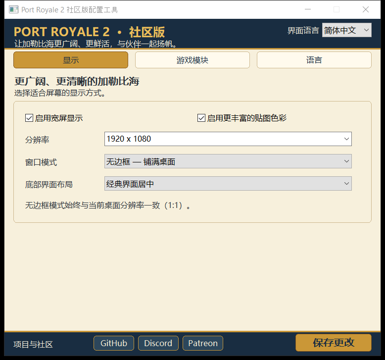
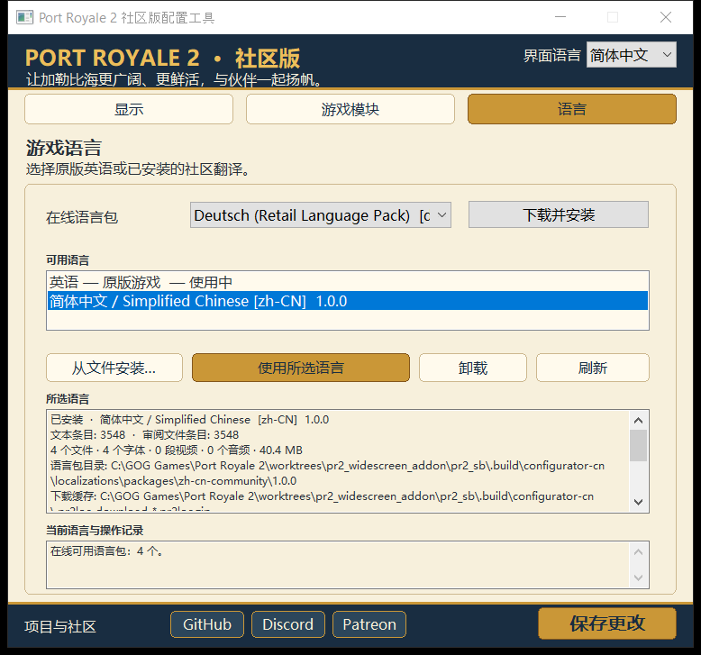

# 海商王2：简体中文社区汉化预览

这是基于英文 GOG 1.1.2.3 的首版简体中文翻译，使用 AI 辅助翻译，并参考西班牙语、俄语版本核对游戏语境。欢迎中文玩家帮助校对。

**当前为技术预览，不是已完成游戏实测的正式汉化。** 配置器中文界面、文件校验、安装与回滚测试已通过；自动启动游戏时，原有渲染模块在显示窗口前报错，尚未完成游戏内画面的视觉验收。

## 内容

- 全部 3548 条原版文本记录：3002 条已翻译，546 条为保留的人名、制作人员名单、按键、资源标识或格式字符。
- 城镇名称、贸易与生产、任务、教程和海战等游戏文本；普通水手与水手等不同等级保持区分。
- 四个静态 TrueType 中文字体，覆盖本翻译使用的全部 2117 种可见字符。
- 不含中文配音、视频或图片。原有英语音频和视频不变；不修改 `PR2.exe` 或 CPR 档案。

## 安装与还原

需要英文 GOG 1.1.2.3、已安装的 PortRoyale2mod，以及本次更新的 **PR2 Addon Configurator.exe**。

1. 关闭游戏，运行游戏目录中的配置器。
2. 在“游戏语言”中选择在线的“简体中文 / Simplified Chinese”，点击“下载并安装”。也可以下载 `zh-cn-community-1.0.0.pr2loc.zip` 后选择本地安装。
3. 选中已安装的中文包，点击“使用所选语言”。正常启动 `PR2.exe`。

还原时选择“英语 — 原版游戏”，点击“使用所选语言”。配置器会校验并恢复它备份的原文件；若文件被其他工具改动，会停止并提示，不会强行覆盖。激活后请继续使用新版配置器完成还原，不要换回旧版配置器。

配置器本身的语言与游戏语言相互独立。首次运行时，简体中文系统会自动使用简体中文界面；不支持的系统语言才会显示语言选择。

## 帮助校对

在 [Issues](https://github.com/berkutx/PortRoyale2mod/issues) 提交截图、中文文本、出现位置和期望表达。若方便，也请附上 `strings.jsonl` 中的 `hash`。

`strings.jsonl` 提供英文原文和中文译文，供人工审阅；修改后需要重新构建语言包，不能只替换已安装包中的文件。数字、`%1` 和 `@g$Gold$` 等变量必须保留。

## 配置器截图

以下是独立测试目录中真实运行的配置器，不是游戏内截图。模块页显示缺少
模块，是因为该 UI 测试目录没有放入游戏模块 DLL。截图时中文包尚未发布，
所以在线列表只有四个已发布语言；中文包通过本地安装显示。

[舰队模块说明](screenshots/03-squadron-zh-CN.png) ·
[下载缓存与回滚路径](screenshots/06-paths-zh-CN.png)

## Font provenance and validation

Package `zh-cn-community`, version `1.0.0`, locale `zh-CN`.
SHA-256: `0CA906B7B85591E9E6D41E9589718CC8826C031D80A0CD86A5732A10213ED975`.

The four fonts are static derivatives of Noto Sans SC at Google Fonts revision
`a85815a42757630ce188fdad368c2dfc444d4773`, instantiated with fonttools 4.64.0
at weights 400/600/700/900. Their family name is **PR2 Community SC**.
The full OFL-1.1 copyright/license is included in the package manifest and
the viewable metadata of each font. [Upstream source and license](https://github.com/google/fonts/tree/a85815a42757630ce188fdad368c2dfc444d4773/ofl/notosanssc).

Automated validation passed all 3548 hashes, original flags, dynamic tokens,
markup and font glyph coverage, with zero missing translations or validation
warnings. Context review distinguishes building permission from owning a town,
trade-route transfer direction, mission conditions, nation relationships,
captain skills and player ranks. These checks do not replace native-player
proofreading or in-game visual acceptance.
